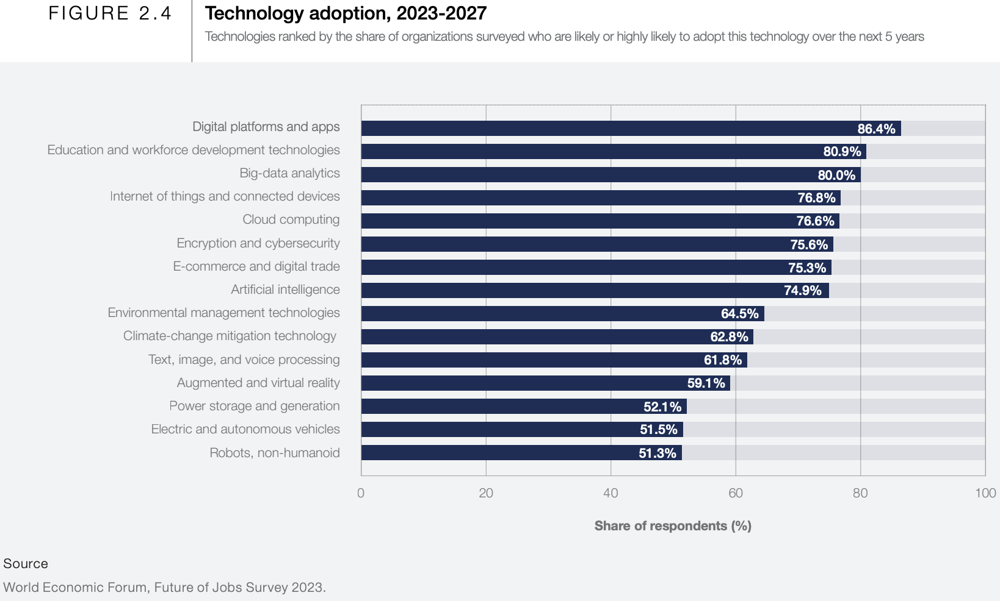

# Design and Development of Interactive Systems

Interactive systems, applications, and plateforms are everywhere. Millions of users interact with interactive systems to perform various tasks daily. This is great for designers and developers because there is a growing demand on building interactive systems across different areas, such as education, business, communication, collaboration, and many more.

## What is this course about?

This course is about building interactive systems, using modern technologies and framefoworks. The course include three modules.

1.  Designing Interactive Web Applications
2.  Designing Interactive XR Applications
3.  Designing APIs and Micro-services

The concepts that we will tackle in this course concern the work area between software **_developers_** and **_designers_**. Let us beriefly identify the work of a developer and the work of designer.

## What is a software developer?

A software developer is a person who applies the [engineering design process](https://en.wikipedia.org/wiki/Engineering_design_process "Engineering design process") to

- **design**,
- **develop**,
- **maintain**,
- **test**, and
- **evaluate** [computer software](https://en.wikipedia.org/wiki/Software "Software")

— Source: <https://en.wikipedia.org/wiki/Software_engineering>

## What is a software designer?

Before we answer this question, what is a design? A straitfoward definition of design is:

> A **design** is a concept of or proposal for an object, a process, or a system.
>
> People who produce designs are called designers […]
>
> A designer's sequence of activities to produce a design is called a design process, using [design thinking](https://en.wikipedia.org/wiki/Design_thinking "Design thinking") and possibly [:u[design methods]]\(<https://en.wikipedia.org/wiki/Design_methods>):u[.]
>
> — source: <https://en.wikipedia.org/wiki/Design>

Designing is the process of developing a designs, concepts, or prototypes.

## What is a design process?

The work of designers and developers follow a “design process.” So, what is a design process?

A design process is a typically an iterative approach to perform a work. In other words, a design process is a series of steps (sequence of activities) in which we:

- Identify and understand the needs or problems (what we should solve, create, develop, etc.)
- Generate solutions to address the needs or problems
- Evaluate solutions, leading to an optimal solution

There are a number of design process: such as Agile, Waterfall, Design Thinking, and others. Each process has strenghts and weeknees. Design processes are beyond the scope of this course.

## What is UX Design and Development?

There is an increasing recognition of the importance of UX (user experience) in the design and development (UXDD) of interactive systems. A straitfoward definition of UXDD is:

> The process that design teams (developers, designers, etc.) use to create products, services, an apps that provide relevant experiences to users.

It is a mix of:

- Computer science
- Design
- Ergonomics, and
- Cognitive psychology

Modern work of desining and developing interactive systems requires that members of design teams have:

- An eye for the design
- Expertise in moden technologies (such as web and others)

## What is “interactive systems”?

Up to know, we outlined the work of a designer and a developer. We also motivated that modern work requires that people who contribute to designing interactive systems have an eye for design and an expertise in development. However, the aim is to design interactive systems, so, what is “interactive systems?”

Here, we have two concepts: System and Interaction. Let us define these first.

### What is a system?

A system is:

- A set of connected things or devices that operate together

- A set of computer equipment and programs used together for a particular purpose

  —Source: <https://dictionary.cambridge.org/dictionary/english/system>

Modern applications are composed of different modular parts. For example, parts of an application could be: a user interface form, a service to authenticate users, an administration dashboard, a database, etc. Such parts are interconnected and work together.

### What is interaction?

Interaction is a “multi-faceted” concept adopted in the field of human-computer interaction (HCI). The field of HCI focuses on the study and the design of technologies, and in particular, the _interaction_ between the humans (users) and computers, with the goal to improve UX.

Anything related to relation between humans and computers is considered as part of the concept interaction (see “What is Interaction?”, Hornbæk and Oulasvirta, 2017).

We want the user to successfully interact with the computer. This interaction, engages the user in a cycle of (1) evaluating the state of the system to understand how to interect with it, then (2) execute an action. The user repeat this cylce until they reach their end-goal.

Early on, people working on HCI understood that users interact with computers in different ways. Users rely on their past experiences, or more specifically, what’s called **mental models,** in their interactions.

> A **mental model** is a theory of how a system works, what its signals mean, and what the outcomes of different user actions will be. To save time, most people :u[rely on their past experiences to quickly build mental models for new systems].
>
> — <https://www.nngroup.com/articles/two-ux-gulfs-evaluation-execution/>

We can use this concept to design interfaces that help users build effective mental models.

1.  Identifying a **relevant design** which users are already **familiar** with
2.  Creating **visual similarities** between the new design and the familiar design
3.  Creating **functional similarities** between the new design and the familiar design

Going back to the question of “what is interactive system.” We can now state that interactive systems are:

> Computer systems characterized by significant amounts of interaction between humans and the computer.

## Attractive market

As mentioned earlier, nowadays, millions of people interact with interactive systems to perform various tasks. And, there is a high demand on platfroms and apps by a more than 80% share market of companies.

— Source work economic forum report
