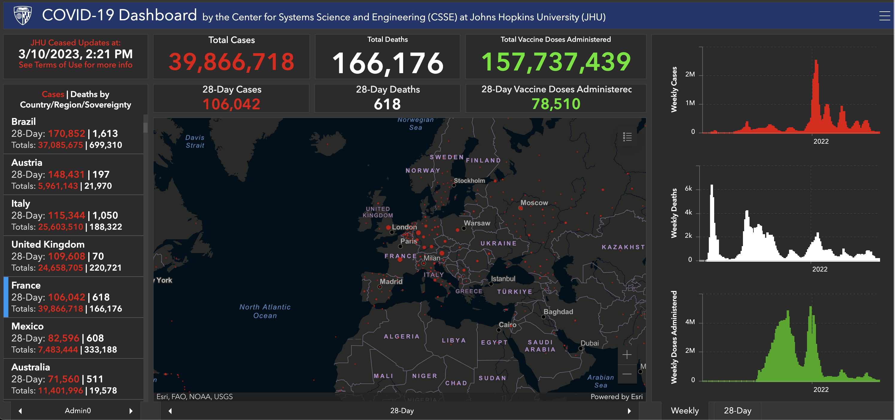

# Designing interactive interfaces

# Motivation

- Millions of people interact with computing interfaces daily.

- When we interact with computing devices, we do so through **_user interfaces (UI)_**.

- User interfaces cross cut

  - a range of modalities from touch- to voice- to mouse-based and
  - a vareity of platforms, including mobiles, laptops, desktops, headsets, and others.

# Mobile interface

# Watch interface

# Computer interface

# The overall goal of user interface design

Is to create a interfaces that make it:

- Easy (self-explanatory)
- Efficient (productive)
- Enjoyable (user-friendly)

For users to perform their desired work

# Human-computer interaction (HCI)

> Is a field of study that brings together researchers, ergonomics, psychologists, designers, and developers aiming at studying, developing, and optimizing how users might interact with computers (or machines and programs in broader terms).

# Question

> _What are the types of user interfaces that you are aware of?_

# Types of User Interfaces

- Touchscreens: Displays that accept user inputs by touch of fingers or stylus (e.g., mobile)
- Gesture interfaces: Displays that accept user inputs as hand, body or mouse gestures
- Command line: Interfaces that accept user inputs as commands of strings (e.g., terminals)
- Attentive user interfaces: Interface that manages users attention, e.g., notifications, level details, interruption
- Tangible user interfaces: Interfaces in which users interact with physical objects in the environment
- Text-based interfaces: Interfaces in which users type texts, e.g., text editor
- Collaborative user interfaces: Interfaces that allow one or more users to collaborate on specific tasks (aka., multiplayer interface)
- Focus+context interface: Interfaces that guide users to grasp the breadth and depth of large body of information from different perspectives while enabling them to locate themselves (i.e., overview+detail, sematic zooming, multiple-coordinated views, layering and separation)
- Intelligent user interfaces: Smart interfaces that adapt to users depending on different factors, tasks, contexts, profile
- Conversational interfaces: Interfaces in which users use natural language or voice to perform interactions like human-to-human ones
- Mixed reality interfaces: Interfaces that allow users to blend real and virual objects
- Webpages: Interconnected pages with aides that help users navigate and access bodies of content
- Desktop apps: windows, menus, and supporting components that enable users to perform complex tasks
- Web apps: (SPAs) provide functions of desktop apps on a webpage following conventions of a desktop applications
- Mobile apps: Small touch-based interfaces

# Touch-based interfaces

> Displays that accept user inputs by touch of fingers or stylus (e.g., mobile)

# Gesture-based interfaces

> Displays that accept user inputs as hand, body or mouse gestures

> <https://vladmandic.github.io/human/demo/index.html>

# Command-line interfaces

> Interfaces that accept user inputs as commands of strings (e.g., terminals)

# Attentive interfaces

> Interface that manages users attention, e.g., notifications, level details, interruption

# Tangible interfaces

> Interfaces in which users interact with physical objects in the environment

# Text-based interfaces

> Interfaces in which users type texts, e.g., text editor

# Collaborative Interfaces

> Interfaces that allow one or more users to collaborate on specific tasks (aka., multiplayer interface)

# Mixed Reality Interfaces

> Interfaces that allow users to blend real and virual objects

# Focus+context: Overview+Detail

> Interfaces that guide users to grasp the breadth and depth of large body of information from different perspectives while enabling them to locate themselves

# Focus+context: Semantic Zooming

# Focus+context: Multiple-coordinated views

# Intelligent Interfaces

> Smart interfaces that adapt to users depending on different factors, tasks, contexts, profile

# Conversational Interfaces

> Interfaces in which users use natural language or voice to perform interactions like human-to-human ones

# Today, computer user is very different

We combine a range of technologies, desktop apps, laptop apps, web apps, smartphones, files, emails and many others tools.

Current work requires collaboration, multitasking, multiple roles, and diverse technologies.

Today apps require the integration of diverse workflows, cutting across multiple applications and contexts.

# Designing integrated digital work environments

:ref[Integrated digital work environments]{path='/notes'}
