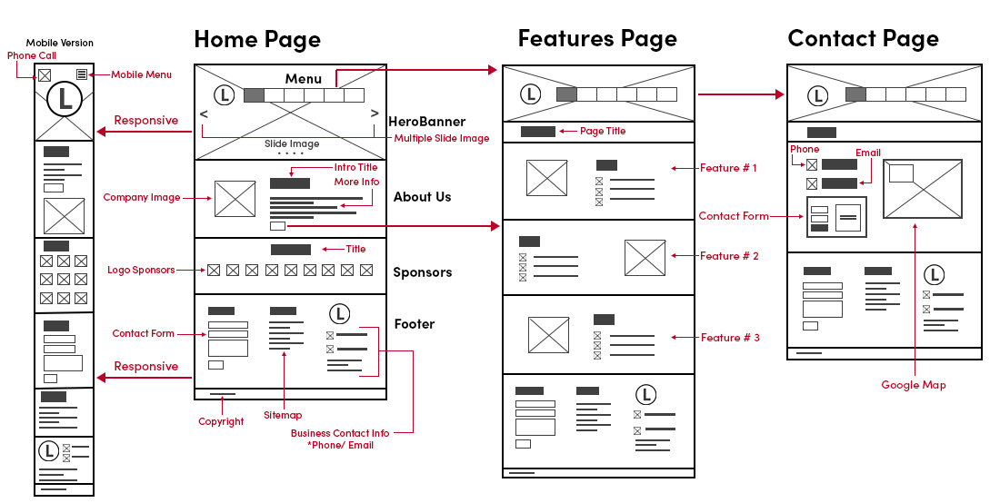

# Prototyping User Interface

> Fast and easy way to build approximations of user interfaces to explore, demonstrate, analyze, test, and refine design ideas.

## Prototyping Methods

There are a wide range of prototyping methods. This includes:

- Paper prototyping
- Wireframes
- Annotations
- Interactive prototyping
- Native prototyping

## How to

- Choose a user who represents the audience (Personas)

- Determine user tasks

- Make screenshots and /or hand sketches of items needed to perform tasks

  - windows, menus, dialog boxes, pages, buttons, data, pop-up messages

- Conduct usability test

  - Have a user attempt tasks outlined by interacting directly with the prototype

    - User: person representative of your audience
    - Observers: note-takers who watch session

## **Prototypes and level of fidelity**

> The level of detail in which a design is represented in the prototype.

Two ends of a fidelity spectrum:

- Low-fidelity (lo-fi) prototyping
- High-fidelity (hi-fi) prototyping

As a principle, use no higher resolution than is necessary.

**This is just an idea. I'm not done!**

- Has lower development cost
- Prevents designers from prematurely wedding to specific design ideas
- Enables exploring, communicating, and testing of conceptual designs
- Helps designers identify structural, navigation, and organizational issues
- Allows rapid evaluation of multiple design ideas
- Enables communication among stakeholders
- Allows identifying market requirements before dedicating resources to development

**Limitations of Lo-fi Prototyping**

- Requires a facilitator to drive the prototype during testing and communication
- Offers limited ability to identify breakdowns in design
- Lacks sufficiently low-level specifications for development (no code)
- Provides limited sense of feasibility

## Paper Prototyping

> Mocks of design ideas created by sketching pages and screens using paper, pencils, markers, scissors, tape, etc. Simulation of how the system would respond to user input by changing, moving, and swapping different pages and screens.

Paper prototyping is mainly useful early in the design process.

## Wireframes

> Lo-fi mockups that show structural components of the design, its state of layouts, navigations, contents

## Storyboards

> A connected series of drawings or images showing how an interface can be used to accomplish a task. Storyboards focus on flow of interactions.

## Annotations

> Labels, legends, explanations, and notes that provide further information on the goals, content, adn functioning of the design elements illustrated on prototype.

Help explain and interpret prototypes and user interactions

## Interactive prototyping

> Creating realistic prototypes of the layout, navigation, or structural components with a series of digital screens, pages, transitions and interactions.

## Native prototyping

> Implementing and testing design ideas on the target technology platform.
>
> Coding the prototype.

## **Prototyping Theory**

**Prototyping can be seen as a three-dimensional system**

- Role
- Look and feel
- implementation

:::excalidraw
[{"type":"line","version":253,"versionNonce":1362761386,"isDeleted":false,"id":"W8-sey-jFTHCdDwk_2Fr9","fillStyle":"hachure","strokeWidth":1,"strokeStyle":"solid","roughness":1,"opacity":100,"angle":0,"x":372,"y":456.6875,"strokeColor":"#000000","backgroundColor":"transparent","width":191,"height":163,"seed":896223158,"groupIds":[],"frameId":null,"roundness":null,"boundElements":[],"updated":1696847841033,"link":null,"locked":false,"startBinding":null,"endBinding":null,"lastCommittedPoint":null,"startArrowhead":null,"endArrowhead":null,"points":[[0,0],[-113,156],[78,163],[0,0]]},{"type":"line","version":149,"versionNonce":68584682,"isDeleted":false,"id":"thZpDQPzYFTM1adHQGIqz","fillStyle":"hachure","strokeWidth":1,"strokeStyle":"solid","roughness":1,"opacity":100,"angle":0,"x":325,"y":525.6875,"strokeColor":"#000000","backgroundColor":"transparent","width":83,"height":89,"seed":1205186922,"groupIds":[],"frameId":null,"roundness":null,"boundElements":[],"updated":1696847849873,"link":null,"locked":false,"startBinding":null,"endBinding":null,"lastCommittedPoint":null,"startArrowhead":null,"endArrowhead":null,"points":[[0,0],[83,5],[28,89],[0,0]]},{"type":"ellipse","version":42,"versionNonce":541435370,"isDeleted":false,"id":"P0rxr88zTDwpyftV8ggHa","fillStyle":"hachure","strokeWidth":4,"strokeStyle":"solid","roughness":1,"opacity":100,"angle":0,"x":356,"y":549.6875,"strokeColor":"#000000","backgroundColor":"#4c6ef5","width":11,"height":13,"seed":965367722,"groupIds":[],"frameId":null,"roundness":null,"boundElements":[{"id":"MRleoezotYg5psN36hHxs","type":"arrow"}],"updated":1696848071640,"link":null,"locked":false},{"type":"text","version":6,"versionNonce":1013010730,"isDeleted":false,"id":"4AIQP_aJOlQ1ySzFhR0pP","fillStyle":"hachure","strokeWidth":4,"strokeStyle":"solid","roughness":1,"opacity":100,"angle":0,"x":373,"y":417.6875,"strokeColor":"#862e9c","backgroundColor":"#4c6ef5","width":40.84000015258789,"height":25,"seed":537173674,"groupIds":[],"frameId":null,"roundness":null,"boundElements":[],"updated":1696848093554,"link":null,"locked":false,"fontSize":20,"fontFamily":1,"text":"Role","textAlign":"left","verticalAlign":"top","containerId":null,"originalText":"Role","lineHeight":1.25,"baseline":18},{"type":"text","version":28,"versionNonce":292642550,"isDeleted":false,"id":"7903nqLF48oqCxAunDBb1","fillStyle":"hachure","strokeWidth":4,"strokeStyle":"solid","roughness":1,"opacity":100,"angle":0,"x":470,"y":622.6875,"strokeColor":"#5f3dc4","backgroundColor":"#4c6ef5","width":134.79998779296875,"height":25,"seed":1641174198,"groupIds":[],"frameId":null,"roundness":null,"boundElements":[],"updated":1696848081825,"link":null,"locked":false,"fontSize":20,"fontFamily":1,"text":"Look and feel","textAlign":"left","verticalAlign":"top","containerId":null,"originalText":"Look and feel","lineHeight":1.25,"baseline":18},{"type":"text","version":2,"versionNonce":556140854,"isDeleted":true,"id":"19tE8R6QWUd8gNhgHleAo","fillStyle":"hachure","strokeWidth":4,"strokeStyle":"solid","roughness":1,"opacity":100,"angle":0,"x":153,"y":630.6875,"strokeColor":"#000000","backgroundColor":"#4c6ef5","width":10,"height":25,"seed":349153898,"groupIds":[],"frameId":null,"roundness":null,"boundElements":[],"updated":1696847889994,"link":null,"locked":false,"fontSize":20,"fontFamily":1,"text":"","textAlign":"left","verticalAlign":"top","containerId":null,"originalText":"","lineHeight":1.25,"baseline":18},{"type":"text","version":2,"versionNonce":1084033706,"isDeleted":true,"id":"QzmwutCuVmSo-u2jx44f2","fillStyle":"hachure","strokeWidth":4,"strokeStyle":"solid","roughness":1,"opacity":100,"angle":0,"x":201,"y":630.6875,"strokeColor":"#000000","backgroundColor":"#4c6ef5","width":10,"height":25,"seed":1279498218,"groupIds":[],"frameId":null,"roundness":null,"boundElements":[],"updated":1696847892707,"link":null,"locked":false,"fontSize":20,"fontFamily":1,"text":"","textAlign":"left","verticalAlign":"top","containerId":null,"originalText":"","lineHeight":1.25,"baseline":18},{"type":"text","version":38,"versionNonce":1293291574,"isDeleted":false,"id":"V8ESbbsLIHdnBbzMl3tlZ","fillStyle":"hachure","strokeWidth":4,"strokeStyle":"solid","roughness":1,"opacity":100,"angle":0,"x":105,"y":633.6875,"strokeColor":"#1864ab","backgroundColor":"#4c6ef5","width":143.29998779296875,"height":25,"seed":132507690,"groupIds":[],"frameId":null,"roundness":null,"boundElements":[],"updated":1696848084948,"link":null,"locked":false,"fontSize":20,"fontFamily":1,"text":"Implementation","textAlign":"left","verticalAlign":"top","containerId":null,"originalText":"Implementation","lineHeight":1.25,"baseline":18},{"type":"text","version":50,"versionNonce":522318186,"isDeleted":true,"id":"yD4TDD_5z_9dVoStguO_k","fillStyle":"hachure","strokeWidth":4,"strokeStyle":"solid","roughness":1,"opacity":100,"angle":0,"x":585,"y":453.6875,"strokeColor":"#000000","backgroundColor":"#4c6ef5","width":110.54000854492188,"height":25,"seed":1232822122,"groupIds":[],"frameId":null,"roundness":null,"boundElements":[],"updated":1696848024560,"link":null,"locked":false,"fontSize":20,"fontFamily":1,"text":"Integration","textAlign":"left","verticalAlign":"top","containerId":null,"originalText":"Integration","lineHeight":1.25,"baseline":18},{"type":"arrow","version":290,"versionNonce":376275766,"isDeleted":true,"id":"zMNfyn-PXSqNp3kH3rFwG","fillStyle":"hachure","strokeWidth":4,"strokeStyle":"solid","roughness":1,"opacity":20,"angle":0,"x":566,"y":496.6875,"strokeColor":"#000000","backgroundColor":"#4c6ef5","width":354,"height":106,"seed":1300038582,"groupIds":[],"frameId":null,"roundness":null,"boundElements":[],"updated":1696847948573,"link":null,"locked":false,"startBinding":null,"endBinding":null,"lastCommittedPoint":null,"startArrowhead":null,"endArrowhead":"arrow","points":[[0,0],[-180,53],[13,64],[58,84],[174,106],[55,92],[162,46]]},{"type":"arrow","version":434,"versionNonce":1966817910,"isDeleted":true,"id":"oTDh_OUbk4_GP8-5kbJZ6","fillStyle":"hachure","strokeWidth":1,"strokeStyle":"solid","roughness":1,"opacity":100,"angle":0,"x":603.4633913370618,"y":480.68750000000006,"strokeColor":"#000000","backgroundColor":"#4c6ef5","width":230.60006706282996,"height":72.62409624445212,"seed":1103725750,"groupIds":[],"frameId":null,"roundness":null,"boundElements":[],"updated":1696848000119,"link":null,"locked":false,"startBinding":{"elementId":"yD4TDD_5z_9dVoStguO_k","focus":-0.09724647259274616,"gap":2.000000000000057},"endBinding":{"elementId":"P0rxr88zTDwpyftV8ggHa","focus":0.10447823192857338,"gap":6.165989875192861},"lastCommittedPoint":null,"startArrowhead":null,"endArrowhead":"arrow","points":[[0,0],[-230.60006706282996,72.62409624445212]]},{"type":"text","version":3,"versionNonce":1183053622,"isDeleted":true,"id":"z0NJVgYkYZco_Jaah8dCv","fillStyle":"hachure","strokeWidth":1,"strokeStyle":"solid","roughness":1,"opacity":100,"angle":0,"x":458.5,"y":506.6875,"strokeColor":"#000000","backgroundColor":"#4c6ef5","width":10,"height":25,"seed":1205931754,"groupIds":[],"frameId":null,"roundness":null,"boundElements":[],"updated":1696847974172,"link":null,"locked":false,"fontSize":20,"fontFamily":1,"text":"","textAlign":"center","verticalAlign":"middle","containerId":"oTDh_OUbk4_GP8-5kbJZ6","originalText":"","lineHeight":1.25,"baseline":18},{"type":"freedraw","version":4,"versionNonce":1470991530,"isDeleted":true,"id":"0-wuqAt3FhxAcqSTFV6ge","fillStyle":"hachure","strokeWidth":1,"strokeStyle":"solid","roughness":1,"opacity":100,"angle":0,"x":606,"y":477.6875,"strokeColor":"#000000","backgroundColor":"#4c6ef5","width":0.0001,"height":0.0001,"seed":152844970,"groupIds":[],"frameId":null,"roundness":null,"boundElements":[],"updated":1696848030765,"link":null,"locked":false,"points":[[0,0],[0.0001,0.0001]],"lastCommittedPoint":null,"simulatePressure":false,"pressures":[0,0]},{"type":"line","version":157,"versionNonce":849821942,"isDeleted":true,"id":"DxcWhlolVObfxgLBI0U-N","fillStyle":"hachure","strokeWidth":1,"strokeStyle":"solid","roughness":1,"opacity":100,"angle":0,"x":634,"y":477.6875,"strokeColor":"#000000","backgroundColor":"#4c6ef5","width":247,"height":74,"seed":298225206,"groupIds":[],"frameId":null,"roundness":null,"boundElements":[],"updated":1696848020661,"link":null,"locked":false,"startBinding":null,"endBinding":null,"lastCommittedPoint":null,"startArrowhead":null,"endArrowhead":null,"points":[[0,0],[-118,14],[-247,74]]},{"type":"text","version":17,"versionNonce":1600186794,"isDeleted":false,"id":"4lU7ipYArry-9gSJpSIo0","fillStyle":"hachure","strokeWidth":1,"strokeStyle":"solid","roughness":1,"opacity":100,"angle":0,"x":583,"y":453.6875,"strokeColor":"#5c940d","backgroundColor":"#4c6ef5","width":110.54000854492188,"height":25,"seed":1130470454,"groupIds":[],"frameId":null,"roundness":null,"boundElements":[{"id":"MRleoezotYg5psN36hHxs","type":"arrow"}],"updated":1696848100560,"link":null,"locked":false,"fontSize":20,"fontFamily":1,"text":"Integration","textAlign":"left","verticalAlign":"top","containerId":null,"originalText":"Integration","lineHeight":1.25,"baseline":18},{"type":"arrow","version":245,"versionNonce":903304938,"isDeleted":false,"id":"MRleoezotYg5psN36hHxs","fillStyle":"hachure","strokeWidth":1,"strokeStyle":"solid","roughness":2,"opacity":100,"angle":0,"x":599.0000000000001,"y":482.68750000000006,"strokeColor":"#000000","backgroundColor":"#4c6ef5","width":218.00735572051792,"height":65.00219321942035,"seed":974896310,"groupIds":[],"frameId":null,"roundness":{"type":2},"boundElements":[],"updated":1696848095971,"link":null,"locked":false,"startBinding":{"elementId":"4lU7ipYArry-9gSJpSIo0","focus":-0.16532511438415334,"gap":4},"endBinding":{"elementId":"P0rxr88zTDwpyftV8ggHa","focus":-0.40064272264531076,"gap":15.613800220108779},"lastCommittedPoint":null,"startArrowhead":null,"endArrowhead":"arrow","points":[[0,0],[-218.00735572051792,65.00219321942035]]},{"type":"text","version":3,"versionNonce":1226688822,"isDeleted":true,"id":"DQPXegpgGgfVUYuBwz0gk","fillStyle":"hachure","strokeWidth":1,"strokeStyle":"solid","roughness":1,"opacity":100,"angle":0,"x":484,"y":507.6875,"strokeColor":"#000000","backgroundColor":"#4c6ef5","width":10,"height":25,"seed":1350737130,"groupIds":[],"frameId":null,"roundness":null,"boundElements":[],"updated":1696848054252,"link":null,"locked":false,"fontSize":20,"fontFamily":1,"text":"","textAlign":"center","verticalAlign":"middle","containerId":"MRleoezotYg5psN36hHxs","originalText":"","lineHeight":1.25,"baseline":18},{"type":"text","version":2,"versionNonce":27870518,"isDeleted":true,"id":"uTAG1-DkNVgOypp_FchJQ","fillStyle":"hachure","strokeWidth":1,"strokeStyle":"solid","roughness":2,"opacity":100,"angle":0,"x":417,"y":426.6875,"strokeColor":"#1864ab","backgroundColor":"#4c6ef5","width":10,"height":25,"seed":1032270838,"groupIds":[],"frameId":null,"roundness":null,"boundElements":[],"updated":1696848089886,"link":null,"locked":false,"fontSize":20,"fontFamily":1,"text":"","textAlign":"left","verticalAlign":"top","containerId":null,"originalText":"","lineHeight":1.25,"baseline":18},{"type":"text","version":2,"versionNonce":821504362,"isDeleted":true,"id":"Weq0_usE8ppimhKM7VGkG","fillStyle":"hachure","strokeWidth":1,"strokeStyle":"solid","roughness":2,"opacity":100,"angle":0,"x":701,"y":464.6875,"strokeColor":"#862e9c","backgroundColor":"#4c6ef5","width":10,"height":25,"seed":1596624554,"groupIds":[],"frameId":null,"roundness":null,"boundElements":[],"updated":1696848095932,"link":null,"locked":false,"fontSize":20,"fontFamily":1,"text":"","textAlign":"left","verticalAlign":"top","containerId":null,"originalText":"","lineHeight":1.25,"baseline":18}]
:::

Each dimension can have different levels of fidelity.

Integration of these three dimensions represent a working prototype or (pre-alpha version)

## Role

> Functions that the system represents and servse in the user life. How it is useful to them.

## Look and feel

> Simulate the functional and emotional experience emanating from using the system.

## Implementation

> Technical aspects and capabilities that enable the system to work.

## Integration

> A complete user experience with the system as envisioned in the conceptual design.

## Prototyping strategies

- Throwaway prototyping
- Evolutionary prototyping
- Incremental prototyping
- Extreme prototyping

## Throwaway prototyping

Rapid prototyping to explore design ideas, demonstrate feasibility, communicate with stakeholders, and test the ideas with users and eventually discarding the prototype instead of further developing the model into a final product.

## Evolutionary prototyping

Also called _breadboard prototyping_, the design team incrementally builds prototypes of a design idea, tests the idea with users, and refines the prototype until it reaches the desired level of maturity.

## **Incremental prototyping**

Dividing system functionality into slices based on design specifications and incrementally building each slice that is then integrated into the overall system.

## **Extreme prototyping**

Breaking down the development into three phases that build on each other: (1) building a static prototype, (2) building fully functional, interactive components that will simulate services, and (3) finally implementing the services.

## How to choose

low-fidelity paper mockups are rapid, useful

high-fidelity creates more realistic for usability testing-
