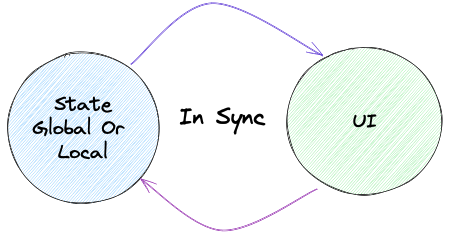

# Reactivity and State

::::cal

> Reactivity is a system that enables easy management of the flows of state data and keeps the user interface (UI) and state data in sync with each other.

::::

What we display to the user in a modern web app is based on data (a list of items, products, user info, etc.). This is the data that lives in the app, also called **state**. The data is transformed into and rendered as DOM using :ref[Components and Props]{path='/notes'}. What we want is that when the data changes, the interface changes automatically as well. To achieve this, we rely on :u[reactive programming].

Reactive programming is the concept of declaratively tracking data streams and triggering changes. This might appear complex but it is not. In modern web, we need this concept of reactivity, to track the state of an app and trigger changes in the UI.

In the modern web, we use the term “data binding”, which is the way to keep the state of the application synchronized with the view or UI (what is displayed in the real DOM). Whenever there is a change in the state, the view gets updated automatically.

— Overview of global or local state in sync with the UI

There are two types of data binding: :u[One-way data binding] and :u[Two-way data binding].

In one-way data binding, the data flows in a single direction, from the state to the view. Any changes made to the state will update the view.

In two-way data binding, the data flows in both directions, from the state to the view and from the view to the state. Any changes made to the state or the view will update the other.

We will explore these two types of data binding with react and svelte examples.

:::excalidraw
[{"type":"ellipse","version":316,"versionNonce":372298062,"isDeleted":false,"id":"9StDTcPaGwYCH2hZM0Coo","fillStyle":"hachure","strokeWidth":1,"strokeStyle":"solid","roughness":1,"opacity":100,"angle":0,"x":14.408450704225345,"y":182.3125,"strokeColor":"#000000","backgroundColor":"#a5d8ff","width":281,"height":279,"seed":645286814,"groupIds":[],"frameId":null,"roundness":{"type":2},"boundElements":[{"type":"text","id":"zWkWmKqD4gJTUG_KaSql7"},{"id":"tTts9XQXEMarOHrZpGQo7","type":"arrow"},{"id":"FmzQbxUMR9K4z7sM1hHMs","type":"arrow"}],"updated":1707403959495,"link":null,"locked":false},{"type":"text","version":397,"versionNonce":200503570,"isDeleted":false,"id":"zWkWmKqD4gJTUG_KaSql7","fillStyle":"hachure","strokeWidth":1,"strokeStyle":"solid","roughness":1,"opacity":100,"angle":0,"x":61.45994947339432,"y":254.17110402447662,"strokeColor":"#000000","backgroundColor":"transparent","width":187.1999969482422,"height":135,"seed":1258669506,"groupIds":[],"frameId":null,"roundness":null,"boundElements":[],"updated":1707404022431,"link":null,"locked":false,"fontSize":36,"fontFamily":1,"text":"State\nGlobal Or \nLocal","textAlign":"center","verticalAlign":"middle","containerId":"9StDTcPaGwYCH2hZM0Coo","originalText":"State\nGlobal Or Local","lineHeight":1.25,"baseline":122},{"type":"ellipse","version":346,"versionNonce":1823390286,"isDeleted":false,"id":"PS-jy9KCvgRGDlM1xhCUy","fillStyle":"hachure","strokeWidth":1,"strokeStyle":"solid","roughness":1,"opacity":100,"angle":0,"x":531.492957746479,"y":172.63644366197184,"strokeColor":"#000000","backgroundColor":"#b2f2bb","width":287,"height":272,"seed":974455902,"groupIds":[],"frameId":null,"roundness":{"type":2},"boundElements":[{"type":"text","id":"qJddJ40vBVXkJtm8-9XYI"},{"id":"FmzQbxUMR9K4z7sM1hHMs","type":"arrow"},{"id":"tTts9XQXEMarOHrZpGQo7","type":"arrow"}],"updated":1707403962517,"link":null,"locked":false},{"type":"text","version":125,"versionNonce":469825614,"isDeleted":false,"id":"qJddJ40vBVXkJtm8-9XYI","fillStyle":"hachure","strokeWidth":1,"strokeStyle":"solid","roughness":1,"opacity":100,"angle":0,"x":652.3611339900815,"y":285.9699214206014,"strokeColor":"#000000","backgroundColor":"transparent","width":45.32400131225586,"height":45,"seed":999204254,"groupIds":[],"frameId":null,"roundness":null,"boundElements":[],"updated":1707404024931,"link":null,"locked":false,"fontSize":36,"fontFamily":1,"text":"UI","textAlign":"center","verticalAlign":"middle","containerId":"PS-jy9KCvgRGDlM1xhCUy","originalText":"UI","lineHeight":1.25,"baseline":32},{"type":"arrow","version":397,"versionNonce":433025618,"isDeleted":false,"id":"tTts9XQXEMarOHrZpGQo7","fillStyle":"hachure","strokeWidth":1,"strokeStyle":"solid","roughness":1,"opacity":100,"angle":0,"x":243.32682357524342,"y":202.978220147063,"strokeColor":"#6741d9","backgroundColor":"transparent","width":354.39506877601616,"height":112.65163564002091,"seed":1508145794,"groupIds":[],"frameId":null,"roundness":{"type":2},"boundElements":[],"updated":1707404023736,"link":null,"locked":false,"startBinding":{"elementId":"9StDTcPaGwYCH2hZM0Coo","gap":8.265508635072589,"focus":-0.2964282875156232},"endBinding":{"elementId":"PS-jy9KCvgRGDlM1xhCUy","gap":6.03490466425645,"focus":0.5612060301938194},"lastCommittedPoint":null,"startArrowhead":null,"endArrowhead":"arrow","points":[[0,0],[148.98303557968612,-112.65163564002091],[354.39506877601616,-15.943648998097103]]},{"type":"arrow","version":450,"versionNonce":911463570,"isDeleted":false,"id":"FmzQbxUMR9K4z7sM1hHMs","fillStyle":"hachure","strokeWidth":1,"strokeStyle":"solid","roughness":1,"opacity":100,"angle":0,"x":587.1118044188188,"y":433.98872125700433,"strokeColor":"#9c36b5","backgroundColor":"transparent","width":325.87560813834784,"height":94.40109739856939,"seed":1917115678,"groupIds":[],"frameId":null,"roundness":{"type":2},"boundElements":[],"updated":1707404023736,"link":null,"locked":false,"startBinding":{"elementId":"PS-jy9KCvgRGDlM1xhCUy","gap":14.736630106304649,"focus":-0.5761191590234505},"endBinding":{"elementId":"9StDTcPaGwYCH2hZM0Coo","gap":2.6929792858141943,"focus":0.17387673091969813},"lastCommittedPoint":null,"startArrowhead":null,"endArrowhead":"arrow","points":[[0,0],[-175.0836354047343,77.4646238134182],[-325.87560813834784,-16.93647358515119]]},{"type":"text","version":2,"versionNonce":1982602114,"isDeleted":true,"id":"Tdbq6dSYFHBtGFQ0tg_De","fillStyle":"hachure","strokeWidth":1,"strokeStyle":"solid","roughness":1,"opacity":100,"angle":0,"x":341.6056338028168,"y":288.91813380281684,"strokeColor":"#000000","backgroundColor":"transparent","width":10,"height":25,"seed":670609758,"groupIds":[],"frameId":null,"roundness":null,"boundElements":[],"updated":1696553986910,"link":null,"locked":false,"fontSize":20,"fontFamily":1,"text":"","textAlign":"left","verticalAlign":"top","containerId":null,"originalText":"","lineHeight":1.25,"baseline":18},{"type":"text","version":2,"versionNonce":1985520386,"isDeleted":true,"id":"H1Ks-H_dM3uLPJHTSknIU","fillStyle":"hachure","strokeWidth":1,"strokeStyle":"solid","roughness":1,"opacity":100,"angle":0,"x":341.6056338028168,"y":288.91813380281684,"strokeColor":"#000000","backgroundColor":"transparent","width":10,"height":25,"seed":920738626,"groupIds":[],"frameId":null,"roundness":null,"boundElements":[],"updated":1696553987826,"link":null,"locked":false,"fontSize":20,"fontFamily":1,"text":"","textAlign":"left","verticalAlign":"top","containerId":null,"originalText":"","lineHeight":1.25,"baseline":18},{"type":"text","version":112,"versionNonce":1520222274,"isDeleted":false,"id":"78HJ42krJjlrCVwQfQFtv","fillStyle":"hachure","strokeWidth":1,"strokeStyle":"solid","roughness":1,"opacity":100,"angle":0,"x":333.1549295774646,"y":274.8336267605632,"strokeColor":"#000000","backgroundColor":"transparent","width":159.35831806021642,"height":55.98591549295763,"seed":1287524958,"groupIds":[],"frameId":null,"roundness":null,"boundElements":[],"updated":1696554066075,"link":null,"locked":false,"fontSize":44.78873239436609,"fontFamily":1,"text":"In Sync","textAlign":"left","verticalAlign":"top","containerId":null,"originalText":"In Sync","lineHeight":1.25,"baseline":39},{"type":"text","version":2,"versionNonce":605041630,"isDeleted":true,"id":"wwD1NgDcdK2tQjl9IrzQr","fillStyle":"hachure","strokeWidth":1,"strokeStyle":"solid","roughness":1,"opacity":100,"angle":0,"x":328.9295774647886,"y":298.7772887323943,"strokeColor":"#000000","backgroundColor":"transparent","width":10,"height":25,"seed":647026590,"groupIds":[],"frameId":null,"roundness":null,"boundElements":[],"updated":1696553997835,"link":null,"locked":false,"fontSize":20,"fontFamily":1,"text":"","textAlign":"left","verticalAlign":"top","containerId":null,"originalText":"","lineHeight":1.25,"baseline":18},{"type":"text","version":3,"versionNonce":1823810322,"isDeleted":true,"id":"iF5XejlAg5FbomKl5dGHn","fillStyle":"solid","strokeWidth":2,"strokeStyle":"solid","roughness":1,"opacity":100,"angle":0,"x":682.8924731182798,"y":135.42355510752694,"strokeColor":"#f08c00","backgroundColor":"#b2f2bb","width":10,"height":25,"seed":2075798226,"groupIds":[],"frameId":null,"roundness":null,"boundElements":[],"updated":1707403992068,"link":null,"locked":false,"fontSize":20,"fontFamily":1,"text":"","textAlign":"left","verticalAlign":"top","containerId":null,"originalText":"","lineHeight":1.25,"baseline":18}]
:::
