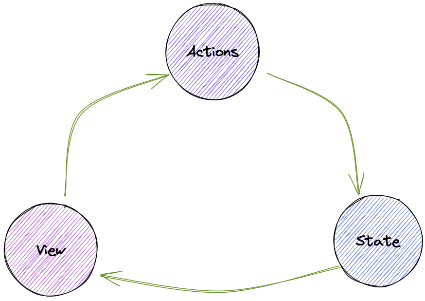
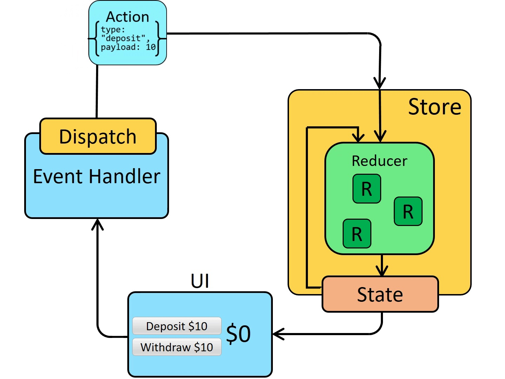

# Store and State Management

The store is a centralized place to store and manage the state of an application.

Modern web apps handle a lot of data. And, when apps grow in size, it becomes a problem to track all data flows in a predictable and easy-to-maintain manner. This problem becomes even more pronounced when we need to share data across multiple components of an app. Passing data down using props is not ideal with deep nested component trees. The store relies on information architecture and reactive programming patterns to solve this problem.

In modern web apps, a store is a centralized place to store and manage the state of an application (data values). It allows different components to share and modify the data, without the need for complex prop drilling (passing data down between components) or event handling (emitting data across the app). Redux, Zustand, and Valtio are known for React. Valtio is intuitive and very efficient in re-rending on changes in the state. Svelte has a built-in mechanism for state management. Some important concepts of state management are the **_store_** and **_actions_**.

## Model: State-View-Action

    function Counter() {
      // State: a counter value
      const [counter, setCounter] = useState(0)

      // Action: code that causes an update to the state when something happens
      const increment = () => {
        setCounter(prevCounter => prevCounter + 1)
      }

      // View: the UI definition
      return (
        <div>
          Value: {counter} <button onClick={increment}>Increment</button>
        </div>
      )
    }

- The **state**, the source of truth that drives our app;
- The **view**, a declarative description of the UI based on the current state
- The **actions**, the events that occur in the app based on user input, and trigger updates in the state

— Overview of Model-View-Action

This is a simple example of **"one-way data flow"**:

- State: Describes the condition (**_data_**) of the app at a specific point in time
- UI: Rendered based on that **_state_**
- State Updates: The state is updated based on **_actions_** (such as a user clicking a button)
- UI Re-render: Based on the **_new state_**

## Challenge

The model SVA ensures independence between views and states and provides more structure and maintainability to our code. However, it becomes challenging when multiple components need to share and use the same state, especially, when components are made modular and live in different parts of the app.

To solve this problem, we can extract the state into a centralized place (shared by all app components). This centralized place is often referred to as a store or the global state.

## **Store**

A store is a place where you can store and manage the state of your application. Instead of having multiple components manage their state, you can have a single store that manages the state for all components.

## **Actions**

Stores can have actions, which are functions that can modify the state of the store. Actions are useful for encapsulating complex logic and keeping the store API simple. Most store managers distinguish between pure actions (synchronous and predictable) and actions with side effects (asynchronous and unpredictable). Actions can be dispatched (e.g., redux) or called to modify the state.

```js
// Define an action to increment the count
import { count } from "./store";

export function increment() {
  count.update((n) => n + 1);
}
```

## Considerations

### Single source of truth

The state data should exist in one place that is the store and not be duplicated in different places.

### The state is read-only

## Case Redux

Redux is a tool and a design pattern that popularized this approach of MVA.

— Overview of Redux <https://redux.js.org/tutorials/essentials/part-1-overview-concepts>

## React Valtio

```js
// store.js
// using valtio
import { proxy, useSnapshot } from "valtio";

const state = proxy({ count: 0, text: "hello" });

// state now can be changed directly, for example:
setInterval(() => {
  ++state.count;
}, 1000);

// or actions
export const incrementByN = (n) => {
  state.count = state.count + n;
};

// CountComponent.js
import { incrementByN } from "./store";

// inside a component, use the hook useSnapshot
// The component will re-render when a variable that binded to the component from the store changes. Here it will re-render on `state.count` change but not on `state.text` change
function Counter() {
  const snap = useSnapshot(state);
  return (
    <div>
      {snap.count}
      <button onClick={() => ++state.count}>+1</button>
      <button onClick={incrementByN}>+N</button>
    </div>
  );
}
```

## Svelte Writable

```js
// store.js
import { writable } from 'svelte/store';

export const count = writable(0);

// increment.js
<script>
	import { count } from './stores.js';

	function increment() {
		// TODO increment the count
	}
</script>

<button on:click={increment}>
	+
</button>

// App.svelte
<script>
	import { count } from './stores.js';
	import Incrementer from './Incrementer.svelte';

	let countValue;

	count.subscribe(value => {
		countValue = value;
	});
</script>

<h1>The count is {countValue}</h1>

<Incrementer/>
```

## More

:::excalidraw
[{"type":"ellipse","version":405,"versionNonce":782656956,"isDeleted":false,"id":"63hue45RCkvpOjgLR8qYp","fillStyle":"hachure","strokeWidth":1,"strokeStyle":"solid","roughness":1,"opacity":100,"angle":0,"x":445.41277167287893,"y":72.8237897667698,"strokeColor":"#000000","backgroundColor":"#7950f2","width":125,"height":127,"seed":779182012,"groupIds":[],"frameId":null,"roundness":{"type":2},"boundElements":[{"type":"text","id":"twnU3kmIReNSP4V12lAWH"},{"id":"DFvl_EPvIyqEuCeeOXaA1","type":"arrow"},{"id":"5C3jpfFOwP0Cz7FV7wtte","type":"arrow"}],"updated":1696153784515,"link":null,"locked":false},{"type":"text","version":490,"versionNonce":1101587460,"isDeleted":false,"id":"twnU3kmIReNSP4V12lAWH","fillStyle":"hachure","strokeWidth":1,"strokeStyle":"solid","roughness":1,"opacity":100,"angle":0,"x":472.65860029012595,"y":123.92250916142405,"strokeColor":"#000000","backgroundColor":"transparent","width":70.1199951171875,"height":25,"seed":784977028,"groupIds":[],"frameId":null,"roundness":null,"boundElements":[],"updated":1696153784515,"link":null,"locked":false,"fontSize":20,"fontFamily":1,"text":"Actions","textAlign":"center","verticalAlign":"middle","containerId":"63hue45RCkvpOjgLR8qYp","originalText":"Actions","lineHeight":1.25,"baseline":18},{"type":"text","version":6,"versionNonce":626045500,"isDeleted":true,"id":"RH0-ApkdajPHMIk6b69x6","fillStyle":"hachure","strokeWidth":1,"strokeStyle":"solid","roughness":1,"opacity":100,"angle":0,"x":458.0337482371986,"y":137.14924697135154,"strokeColor":"#000000","backgroundColor":"transparent","width":10,"height":25,"seed":147271300,"groupIds":[],"frameId":null,"roundness":null,"boundElements":[],"updated":1696152332611,"link":null,"locked":false,"fontSize":20,"fontFamily":1,"text":"","textAlign":"center","verticalAlign":"middle","containerId":"63hue45RCkvpOjgLR8qYp","originalText":"","lineHeight":1.25,"baseline":18},{"type":"ellipse","version":126,"versionNonce":581435196,"isDeleted":false,"id":"43X3nfMrq14pf9N9_jQmS","fillStyle":"hachure","strokeWidth":1,"strokeStyle":"solid","roughness":1,"opacity":100,"angle":0,"x":670.4478895257948,"y":327.70888972120895,"strokeColor":"#000000","backgroundColor":"#4c6ef5","width":117,"height":122,"seed":800969092,"groupIds":[],"frameId":null,"roundness":{"type":2},"boundElements":[{"type":"text","id":"fl0jl51nIquCsSiDOA9X3"},{"id":"DFvl_EPvIyqEuCeeOXaA1","type":"arrow"},{"id":"eAp92ZiPgh9m0Sccl56bI","type":"arrow"}],"updated":1696152428021,"link":null,"locked":false},{"type":"text","version":105,"versionNonce":994550404,"isDeleted":false,"id":"fl0jl51nIquCsSiDOA9X3","fillStyle":"hachure","strokeWidth":1,"strokeStyle":"solid","roughness":1,"opacity":100,"angle":0,"x":699.5621442759667,"y":376.07537606882954,"strokeColor":"#000000","backgroundColor":"transparent","width":59.03999710083008,"height":25,"seed":206707332,"groupIds":[],"frameId":null,"roundness":null,"boundElements":[],"updated":1696152428021,"link":null,"locked":false,"fontSize":20,"fontFamily":1,"text":"State","textAlign":"center","verticalAlign":"middle","containerId":"43X3nfMrq14pf9N9_jQmS","originalText":"State","lineHeight":1.25,"baseline":18},{"type":"ellipse","version":54,"versionNonce":1513204996,"isDeleted":false,"id":"\_X8TjLRUqUsp3Z6XtTp93","fillStyle":"hachure","strokeWidth":1,"strokeStyle":"solid","roughness":1,"opacity":100,"angle":0,"x":229.9210526315789,"y":338.81606359649084,"strokeColor":"#000000","backgroundColor":"#be4bdb","width":124,"height":123,"seed":1255344772,"groupIds":[],"frameId":null,"roundness":{"type":2},"boundElements":[{"type":"text","id":"u_eemPuivkfPiByfWgFYR"},{"id":"eAp92ZiPgh9m0Sccl56bI","type":"arrow"},{"id":"5C3jpfFOwP0Cz7FV7wtte","type":"arrow"}],"updated":1696152430563,"link":null,"locked":false},{"type":"text","version":29,"versionNonce":1557042492,"isDeleted":false,"id":"u_eemPuivkfPiByfWgFYR","fillStyle":"hachure","strokeWidth":1,"strokeStyle":"solid","roughness":1,"opacity":100,"angle":0,"x":273.160432121719,"y":387.82899655351815,"strokeColor":"#000000","backgroundColor":"transparent","width":37.84000015258789,"height":25,"seed":518685444,"groupIds":[],"frameId":null,"roundness":null,"boundElements":[],"updated":1696152430564,"link":null,"locked":false,"fontSize":20,"fontFamily":1,"text":"View","textAlign":"center","verticalAlign":"middle","containerId":"\_X8TjLRUqUsp3Z6XtTp93","originalText":"View","lineHeight":1.25,"baseline":18},{"type":"arrow","version":469,"versionNonce":1946278076,"isDeleted":true,"id":"y7cQy7HGodCjul49LYdrW","fillStyle":"hachure","strokeWidth":1,"strokeStyle":"solid","roughness":1,"opacity":100,"angle":0,"x":551.7379711655374,"y":194.88693384141027,"strokeColor":"#000000","backgroundColor":"#7950f2","width":247.5247524752474,"height":339.60396039603944,"seed":151677756,"groupIds":[],"frameId":null,"roundness":{"type":2},"boundElements":[],"updated":1696152393063,"link":null,"locked":false,"startBinding":{"elementId":"63hue45RCkvpOjgLR8qYp","focus":-0.5019561360499488,"gap":2.9898465085705297},"endBinding":null,"lastCommittedPoint":null,"startArrowhead":null,"endArrowhead":"arrow","points":[[0,0],[139.6039603960395,122.77227722772273],[142.57425742574253,114.85148514851483],[102.97029702970292,166.33663366336629],[93.06930693069307,166.33663366336629],[-6.930693069306926,116.83168316831677],[99.00990099009891,75.24752475247521],[4.95049504950498,148.51485148514848],[-74.25742574257424,164.35643564356428],[-28.712871287128678,117.82178217821775],[173.26732673267315,-173.26732673267315]]},{"type":"arrow","version":718,"versionNonce":1013236228,"isDeleted":false,"id":"DFvl_EPvIyqEuCeeOXaA1","fillStyle":"hachure","strokeWidth":1,"strokeStyle":"solid","roughness":1,"opacity":100,"angle":0,"x":582.2996366631664,"y":163.94719538644256,"strokeColor":"#5c940d","backgroundColor":"#7950f2","width":121.81649816873471,"height":161.4741282655334,"seed":674373892,"groupIds":[],"frameId":null,"roundness":{"type":2},"boundElements":[],"updated":1696153798367,"link":null,"locked":false,"startBinding":{"elementId":"63hue45RCkvpOjgLR8qYp","focus":-0.17584979496425754,"gap":16.731025357835136},"endBinding":{"elementId":"43X3nfMrq14pf9N9_jQmS","focus":-0.17239751163036526,"gap":7.334134659000227},"lastCommittedPoint":null,"startArrowhead":null,"endArrowhead":"arrow","points":[[0,0],[96.90372631622859,52.46825209775545],[121.81649816873471,161.4741282655334]]},{"type":"text","version":4,"versionNonce":985878588,"isDeleted":true,"id":"VqznXhuqKsC2fSd4nQ1AN","fillStyle":"hachure","strokeWidth":1,"strokeStyle":"solid","roughness":1,"opacity":100,"angle":0,"x":613.5696543338541,"y":256.6443595839845,"strokeColor":"#5c940d","backgroundColor":"#7950f2","width":10,"height":25,"seed":1105358012,"groupIds":[],"frameId":null,"roundness":null,"boundElements":[],"updated":1696153798367,"link":null,"locked":false,"fontSize":20,"fontFamily":1,"text":"","textAlign":"center","verticalAlign":"middle","containerId":"DFvl_EPvIyqEuCeeOXaA1","originalText":"","lineHeight":1.25,"baseline":18},{"type":"arrow","version":412,"versionNonce":853928124,"isDeleted":false,"id":"eAp92ZiPgh9m0Sccl56bI","fillStyle":"hachure","strokeWidth":1,"strokeStyle":"solid","roughness":1,"opacity":100,"angle":0,"x":676.610918758467,"y":423.71605272939513,"strokeColor":"#5c940d","backgroundColor":"#7950f2","width":317.14681742264014,"height":33.54711873577736,"seed":533091900,"groupIds":[],"frameId":null,"roundness":{"type":2},"boundElements":[],"updated":1696153801287,"link":null,"locked":false,"startBinding":{"elementId":"43X3nfMrq14pf9N9_jQmS","focus":-0.3808094434482371,"gap":3.723300492844359},"endBinding":{"elementId":"\_X8TjLRUqUsp3Z6XtTp93","focus":0.42619643572046156,"gap":14.383686592363219},"lastCommittedPoint":null,"startArrowhead":null,"endArrowhead":"arrow","points":[[0,0],[-155.56601689986041,33.54711873577736],[-317.14681742264014,12.037427363238464]]},{"type":"text","version":4,"versionNonce":1163333892,"isDeleted":true,"id":"iDxiZwwPg9ZGKDvvJzRYf","fillStyle":"hachure","strokeWidth":1,"strokeStyle":"solid","roughness":1,"opacity":100,"angle":0,"x":530.401337502171,"y":403.17901304933093,"strokeColor":"#5c940d","backgroundColor":"#7950f2","width":10,"height":25,"seed":1487197956,"groupIds":[],"frameId":null,"roundness":null,"boundElements":[],"updated":1696153801287,"link":null,"locked":false,"fontSize":20,"fontFamily":1,"text":"","textAlign":"center","verticalAlign":"middle","containerId":"eAp92ZiPgh9m0Sccl56bI","originalText":"","lineHeight":1.25,"baseline":18},{"type":"arrow","version":422,"versionNonce":855699260,"isDeleted":false,"id":"5C3jpfFOwP0Cz7FV7wtte","fillStyle":"hachure","strokeWidth":1,"strokeStyle":"solid","roughness":1,"opacity":100,"angle":0,"x":309.8029845498066,"y":328.82949487405824,"strokeColor":"#5c940d","backgroundColor":"#7950f2","width":139.5900099166418,"height":161.35690742890313,"seed":1055288380,"groupIds":[],"frameId":null,"roundness":{"type":2},"boundElements":[],"updated":1696153794157,"link":null,"locked":false,"startBinding":{"elementId":"\_X8TjLRUqUsp3Z6XtTp93","focus":0.06658066878027784,"gap":12.159982721724191},"endBinding":{"elementId":"63hue45RCkvpOjgLR8qYp","focus":-0.08216555284462868,"gap":3.5764554517803973},"lastCommittedPoint":null,"startArrowhead":null,"endArrowhead":"arrow","points":[[0,0],[21.000079586839718,-109.73683777876971],[139.5900099166418,-161.35690742890313]]},{"type":"text","version":4,"versionNonce":758493828,"isDeleted":true,"id":"3Z5FugdWoBg6FmtN8CBNt","fillStyle":"hachure","strokeWidth":1,"strokeStyle":"solid","roughness":1,"opacity":100,"angle":0,"x":366.04490185860675,"y":258.62455760378646,"strokeColor":"#5c940d","backgroundColor":"#7950f2","width":10,"height":25,"seed":2043516220,"groupIds":[],"frameId":null,"roundness":null,"boundElements":[],"updated":1696153794157,"link":null,"locked":false,"fontSize":20,"fontFamily":1,"text":"","textAlign":"center","verticalAlign":"middle","containerId":"5C3jpfFOwP0Cz7FV7wtte","originalText":"","lineHeight":1.25,"baseline":18}]
:::
