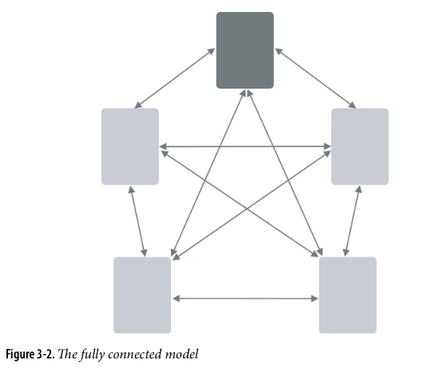
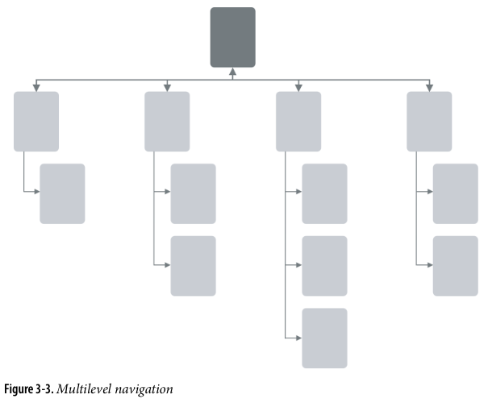
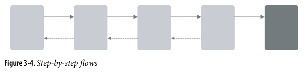
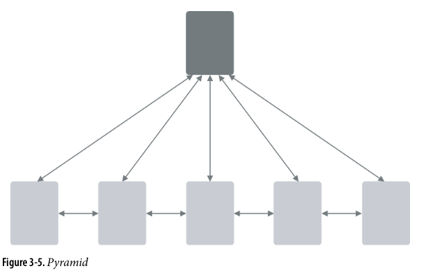
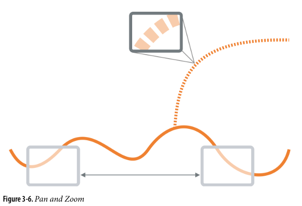

# Navigation Models

## Hub and Spoke

Often used in mobile apps.

A main point (hub) leads to branches

## Fully Connected

## Multilevel or tree

## Step by step

## Pyramid

Galleries

## Flat Navigation

Some apps need little or no navigation at all (e.g., canvas + palette, excel).

## Pan and Zoom

In a zoomable user interface (ZUI), panning refers to the action of moving the viewport or the visible area of the content within the UI in a horizontal or vertical direction.

**Considerations**

- Clear entry points: present only a few main entry points into the interface
- Menu page (index): list of links to content-rich pages (overview in pinfig, google)
- Modal panel: a screen with no navigation options other than acklowledging its message, completing its data entry, or clicking on its actions
- Deep links: capture both location and state in an app. Avoid traversing many pages to get to a desired page
- Escape hatch: A well-labeled button or a link that clearly gets the user out fo their current screen and back to a known place (e.g., “go to the top of a page”)
- Fat menus: a long list of links, options, drop-down and flyout menus,
- Sitemap Footer: a directory of links, often organized into categories that provide an at glance overview of the full scope of the website
- Signin-tools: login logout, profile etc.
- progress indicator: steps of step-by-step navigation model
- annotated scroll bar (a scroll bar with annotations, e.g., number of pages google docs, diffmerge)
- Animated transition: indicated that an action or a change is happening
